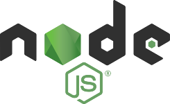

## Привет! 👋

Меня зовут Денис! 
Я учусь на JavaScript разработчика. Хочу сделать разработку частью своей жизни.
С обучением помогает онлайн школа Hexlet.

### Более подробно о моем опыте можно узнать в моем [резюме](https://cv.hexlet.io/ru/resumes/3591)

## Инструменты:
   

## Контакты:
  

<!--
**Dulybnis/Dulybnis** is a ✨ _special_ ✨ repository because its `README.md` (this file) appears on your GitHub profile.

Here are some ideas to get you started:

- 🔭 I’m currently working on ...
- 🌱 I’m currently learning ...
- 👯 I’m looking to collaborate on ...
- 🤔 I’m looking for help with ...
- 💬 Ask me about ...
- 📫 How to reach me: ...
- 😄 Pronouns: ...
- ⚡ Fun fact: ...
-->
